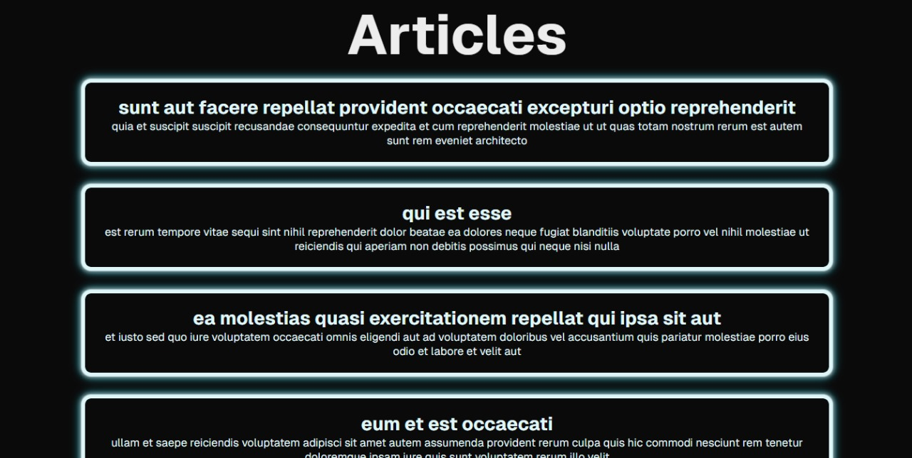
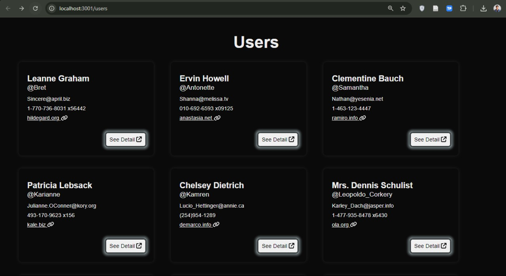
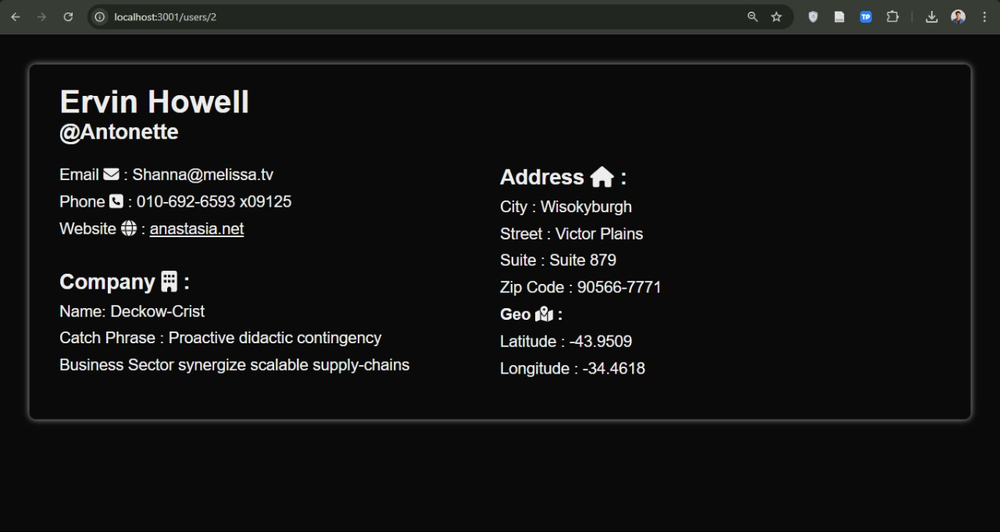
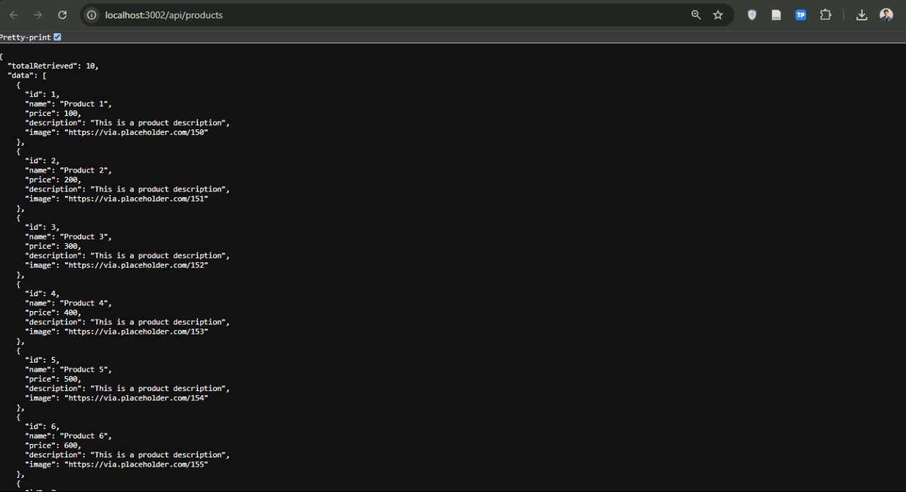
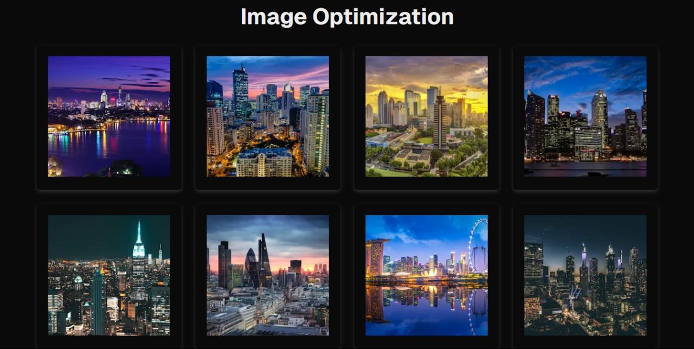

# Technical Test Submission
## For PT Mulya Kencana Metalindo - Web Programmer Position

## How to Run
1. Clone this repository
2. `cd` into the repository

### Run all in one command
Run `./run-all.sh` in the terminal (using linux terminal or git bash is recommended)

### Run with docker-compose
Run `docker-compose up` in the terminal

## Showcase
#### 1. Static Page
[x] Home: 

#### 2. Dynamic Routing 
[x] All Users: 
[x] User Detail: 

#### 3. API routes
[x] All Users: 

#### 5. Image Optimization
[x] Image Optimization: 
